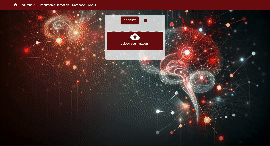

# Webapp : Pneumonia Detection

This is a software to detect pneumonia from a chest X-ray.
You can treat several patients at the same time and then you can store results in a PostGreSQL database.
You have access to this database and you can search someone with is name.

## USAGE

This software is easy to use.

First clone the repo :

`git clone https://github.com/Bessouat40/nginx-reactjs-fastapi-pneumonia-detection.git`

Then rename env file :

`cp .env.example .env`

And now you can run the app :

- First, up database : `docker-compose build db && docker-compose up db` and wait until database is ready

- Then up entire software : `make start`

You can see your PneumonIA running at `http://localhost:3000/`.

## AI Model and AI Explanability

It's a fine tunned VGG16 model.
